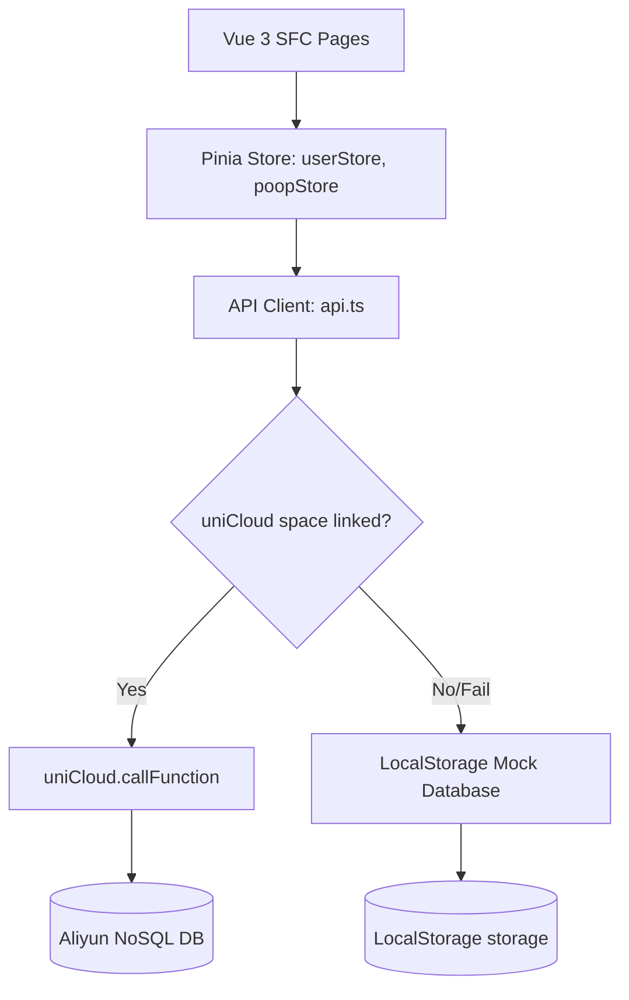

# Design Document

## Overview
本设计文档描述了「粑粑升职记」前端客户端的系统架构与具体实现设计。应用围绕用户如厕数据流展开，包括计时器逻辑、状态转换（空闲 -> 计时中 -> 结算 -> 历史）、以及使用 CSS/SVG 动态渲染统计图表的逻辑。

## Steering Document Alignment

### Technical Standards (tech.md)
开发框架选择 Vue 3 SFC (TypeScript)。数据流采用双模 API 客户端 `api.ts` 设计，通过拦截 `uniCloud.callFunction`，在缺少云空间时自动降级到 LocalStorage 本地模拟。

### Project Structure (structure.md)
目录结构完全遵照 `structure.md` 中对于前端 pages、stores、styles、utils 的约定。

## Architecture

应用整体架构图如下：


### Double-Mode API Client (`src/services/api.ts`)
我们创建一个统一的客户端模块，它暴露一个 `call()` 函数用于数据交互：
```typescript
export async function apiCall<T = any>(
  actionName: string, 
  params: any = {}
): Promise<{ code: number; msg?: string; data?: T }>
```
`apiCall` 内部首先尝试使用 `uniCloud.callFunction` 访问后端云函数。若调用捕获到异常（例如无服务空间、未部署云函数等），则自动重定向到本地的 `MockServer` 类。
`MockServer` 会拦截请求，并模拟所有的云函数行为，将状态持久化到 `uni.setStorageSync` 中。

#### 首次启动 Mock 自动装填逻辑
为了保证用户界面美观饱满（Don't use placeholders），当本地 Mock 库检测到 `poop-sessions` 数据为空时，会随机生成过去 30 天内 20 - 30 条拉屎记录（随机分布在各个时间段，带有不同的舒适度星级与备注），自动生成多张周报，并虚拟一个名为“拉屎天团”的战队，预设 3 名每日活跃的同事（如“马桶总监” 收益¥150.2、“拉屎小王子” 收益¥88.4、“排泄主管” 收益¥65.0），以填充团队排行榜和动态墙。

## Components and Interfaces

### Store: `userStore`
- **Purpose**: 全局维护当前登录用户 Profile、职级和个人设置。
- **Interfaces**:
  - `user`: `User | null`
  - `register(nickname, salary, days, hours)`: 注册并登录。
  - `loadProfile()`: 加载当前用户信息。
  - `updateSalary(salary, days, hours, note)`: 调整薪资参数。
  - `updateSettings(settings)`: 修改久蹲提醒、开关声音/BGM等设置。
- **Dependencies**: `apiCall`

### Store: `poopStore`
- **Purpose**: 维护当前正在计时的拉屎会话，并处理结算历史。
- **Interfaces**:
  - `isPooping`: `boolean` (是否正在计时中)
  - `startTime`: `number` (当前计时开始时间戳)
  - `elapsedSeconds`: `number` (已拉屎秒数)
  - `realtimeEarnings`: `number` (当前带薪工资数)
  - `startSession()`: 开始计时。
  - `tick()`: 每秒更新计时秒数与收益。
  - `cancelSession()`: 中断本次计时。
  - `saveSession(comfort, note)`: 保存拉屎记录到服务端并增加 XP。
  - `fetchHistory(page, limit)`: 查询分页历史记录。
  - `fetchStats(period)`: 获取各项统计。
- **Dependencies**: `apiCall`

## Data Models

数据模型定义于 `src/utils/types.ts`。主要模型包括：
- **User**：存储用户标识、昵称、等级、当前 XP、累计拉屎收益、徽章数组、战队 ID 数组等。
- **PoopSession**：单次如厕会话，包含开始/结束时间、收益金额、经验值、舒适度星级、笔记、是否是工作时间等。
- **Badge**：徽章定义模型。

## Visual Graph Rendering (SVG/CSS)
为保证极致的加载速度和原生平台的流畅度，我们的统计页面图表采用**纯数据驱动的 CSS/SVG** 绘制：

1. **24小时频次直方图**：
   - 采用 Flex 布局的柱状条，高度根据各小时的次数占比计算：`height: (count / maxCount) * 100%`。
   - 使用 CSS `transition` 实现进入时的增长动效。

2. **舒适度趋势折线图**：
   - 使用 SVG 的 `<polyline>` 标签绘制趋势线。
   - 视口尺寸定义为 `viewBox="0 0 300 100"`。
   - 根据最近 7 次的舒适度映射坐标：`X = index * (300 / 6)`，`Y = 100 - (comfort * 20)`，直接渲染 `<polyline :points="pointString" fill="none" stroke="#FF8C42" stroke-width="3" />`。

3. **日历热力图**：
   - 使用 7 列的网格布局（Grid Layout）渲染当月的每一天。
   - 根据每天的如厕次数 `count` 绑定不同的背景色：0次为灰色，1次为浅橙色，2次为中橙色，3次及以上为深橙色。

## Error Handling

1. **未登录拦截**：
   - 在 `apiCall` 执行或页面挂载时检查 `userStore.user` 是否为空。若为空，除 `/pages/login/index` 外的页面均重定向至登录页。

2. **计时异常中断**：
   - 如果用户在计时过程中强行关闭小程序或网页，下一次进入应用时，`onLaunch` 钩子会检测是否存在未保存的当前计时（通过本地存储的当前状态）。若有，可提示用户“检测到您上次有一笔未结算的如厕，是否继续计时或直接结算？”以防数据丢失。

3. **薪资非法数字输入**：
   - 月薪输入框做类型限制，并做前置校验，防止除零错误。
